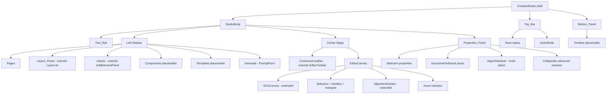
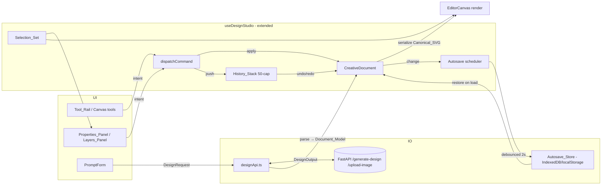
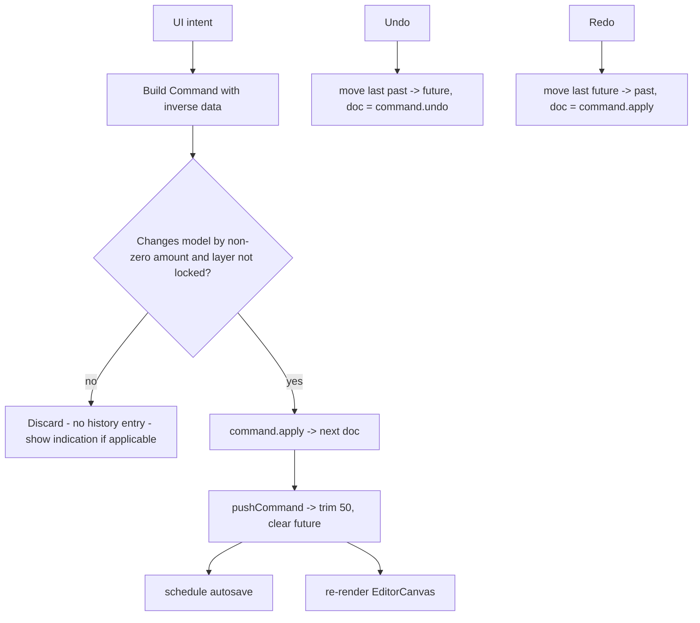
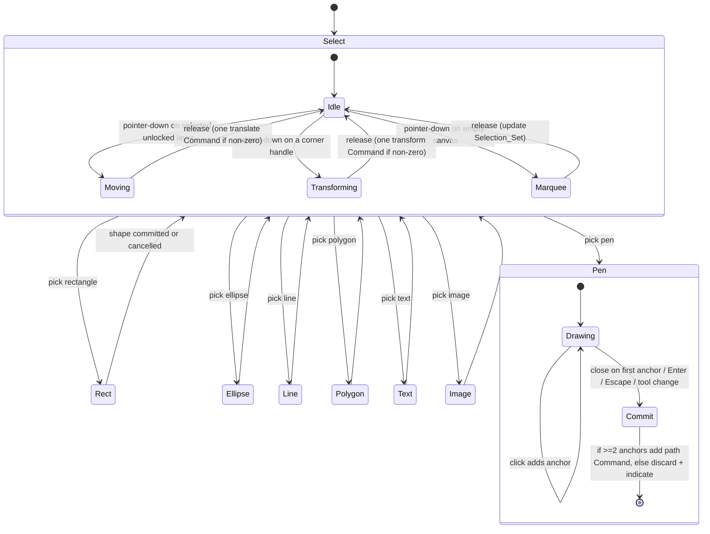
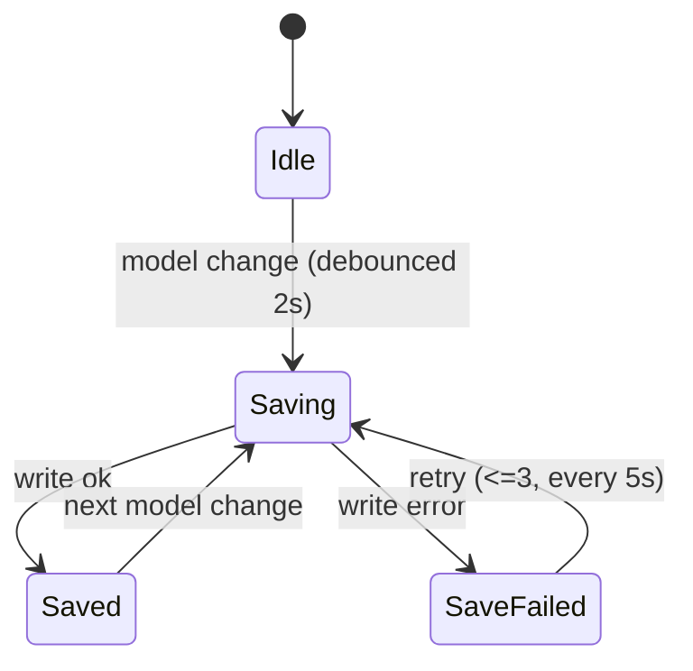

# Design Document: Creative Studio (v1)

## Overview

Creative Studio v1 turns the current single-page `DesignStudio` into a professional, multi-panel
editor (Top_Bar, Tool_Rail, left sidebar with Layers_Panel, center Editor_Canvas, right
Properties_Panel, Bottom_Panel) without rewriting the working foundation. Per the AGENTS.md
universal rules, every existing artifact is **extended, not replaced**: `useDesignStudio.ts`,
`designApi.ts`, the existing component set (`SVGCanvas`, `LayerList`, `EditorToolbar`,
`AddElementPanel`, `AlignmentGuides`, `PromptForm`), and the shared types in
`frontend/src/types/index.ts`.

The central design decision is to introduce an explicit, typed **Document_Model** that is parsed
from the **Canonical_SVG** (`<g data-role>` groups defined in AGENTS.md) and serialized back to it
**without flattening the layer structure**. Today the editor treats the raw `composedSVG` string as
the model and mutates the live DOM in place (see `useDesignStudio.applySvgMutation` and
`SVGCanvas`). v1 keeps that data contract — `DesignOutput.composedSVG` / `svgLayers[]` remain the
interchange format with the backend — but layers a structured model and a command/history system on
top so that undo/redo, autosave, multi-select, and precise property editing become reliable and
testable.

The backend is **consumed, not changed**. `POST /generate-design` and `POST /upload-image` continue
to return `DesignOutput`, and `shared/models.py` remains the single source of truth for the wire
contract. The `data-role` taxonomy (background, shapes, image-slots, body, cta, headline, logo,
print-marks) remains the document's spine; `logo` and `print-marks` stay locked
(`data-editable="false"`).

This design covers the editor architecture, the Document_Model and its parse/serialize strategy, the
SVG rendering approach, the command/history system, the tools state machine, panel data binding, AI
integration, autosave/persistence, export (SVG/PNG/PDF), the monochrome dark-first UI language with
thin line icons, an error-handling strategy, correctness properties, and a testing strategy.

### Requirements coverage map

| Design section | Requirements satisfied |
| --- | --- |
| Architecture | 13.7, 13.8 |
| Document_Model + parse/serialize | 1.1, 1.2, 3.x, 10.3, 10.9, 11.1 |
| Editor_Canvas rendering | 1.1, 1.3–1.12, 6.8 |
| Snap guides | 2.1–2.6, 4.2 |
| Command / History system | 4.5–4.7, 5.5, 6.3, 7.5, 8.4, 9.2, 9.4, 9.6, 11.2–11.6 |
| Tools state machine | 4.1–4.4, 5.1–5.7, 6.1–6.8, 7.1–7.5, 8.1–8.5 |
| Properties_Panel & Layers_Panel | 3.1–3.12, 9.1–9.8, 13.11 |
| AI integration | 10.1–10.9 |
| Autosave / persistence | 11.7–11.10 |
| Export | 12.1–12.6 |
| UI design language | 13.1–13.11 |
| Out-of-scope handling | 14.1–14.7 |

---

## Architecture

### Composition strategy

`DesignStudio.tsx` currently renders a three-column grid (prompt/add panels, canvas, export/layers).
v1 reshapes this into the Creative_Studio shell while reusing the same `useDesignStudio` hook as the
state core. The hook is **extended** (not rewritten) with the Document_Model, Selection_Set, command
dispatch, autosave, and theme state. New presentational components are added under
`frontend/src/editor/` (the directory AGENTS.md assigns to `@canvas-dev`), each with a single
responsibility.

Existing components are mapped into the new shell rather than discarded:

- `PromptForm` → mounted inside the left sidebar **Generate** section (AI entry).
- `AddElementPanel` → folded into the `Tool_Rail` actions and the **Assets** sidebar section.
- `LayerList` → becomes the body of `Layers_Panel` (extended with rename, group, drag-reorder).
- `EditorToolbar` → its controls migrate into `Properties_Panel`; the contextual bar stays as a thin
  canvas-top affordance.
- `SVGCanvas` → wrapped by `EditorCanvas`, which adds pan/zoom, marquee, and multi-select overlay.
- `AlignmentGuides` → reused by the snap-guide subsystem, extended to inter-layer references.

### Component tree



### State core and data flow

State remains centralized in the extended `useDesignStudio` hook. The hook owns the
`CreativeDocument`, the `SelectionSet`, the `HistoryStack`, autosave status, zoom/pan viewport, and
theme. UI components are controlled and dispatch intents (create shape, edit text, move layer, etc.)
that are translated into a single `Command` each, applied through the history dispatcher.



Data-flow rules:

- Pan/zoom changes update only the viewport transform; they never mutate the Document_Model
  (Requirement 1.3) and never produce a Command.
- Every edit that changes the model by a non-zero amount produces **exactly one** Command and pushes
  it onto the History_Stack (Requirements 4.6, 5.5, 6.3, 7.5, 8.4, 9.2, 9.4, 9.6).
- The Document_Model is the single source of truth for rendering and for serialization back to
  Canonical_SVG; `DesignOutput.composedSVG` / `svgLayers[]` are derived on demand for export and for
  backend interchange (Requirement 10.9).

---

## Components and Interfaces

New components live under `frontend/src/editor/`. Each is presentational/controlled; all shared state
flows from the extended hook.

| Component | Responsibility | Extends/derives from |
| --- | --- | --- |
| `CreativeStudio` | Shell layout, theme application, keyboard shortcuts | `DesignStudio.tsx` |
| `TopBar` | Project name, undo/redo, save status, search, AI entry, export, share, profile | new (Req 13.7) |
| `ToolRail` | Tool selection state machine entry points | `AddElementPanel` actions |
| `LeftSidebar` | Pages/Layers/Assets/Components/Templates/Generate sections | `LayerList`, `PromptForm` |
| `LayersPanel` | List, select, reorder, rename, lock, hide, opacity, group | extends `LayerList` |
| `EditorCanvas` | Pan/zoom, selection overlay, marquee, snap guides | wraps `SVGCanvas` |
| `SelectionOverlay` | Bounding box + handles for the Selection_Set | new (Req 1.12) |
| `PropertiesPanel` | Per-selection and document-level property editing | extends `EditorToolbar` |
| `BottomPanel` | History/inspector view + timeline placeholder | new (Req 13.9) |
| `Icon` | Enforced thin line-icon wrapper | new (Req 13.5, 13.6) |

### Hook surface (extension of `UseDesignStudioResult`)

```typescript
// frontend/src/hooks/useDesignStudio.ts — extended, not rewritten
export interface UseCreativeStudioResult extends UseDesignStudioResult {
  document: CreativeDocument | null;
  selection: SelectionSet;
  viewport: Viewport;                       // { zoom: number; panX: number; panY: number }
  activeTool: ToolId;
  theme: Theme;                             // "dark" | "light"
  saveStatus: SaveStatus;                   // "idle" | "saving" | "saved" | "save-failed"
  canUndo: boolean;
  canRedo: boolean;

  dispatchCommand: (command: Command) => void;
  setSelection: (layerIds: string[]) => void;
  toggleSelection: (layerId: string) => void;   // shift-click (Req 1.9, 1.10)
  clearSelection: () => void;                    // empty-canvas click (Req 1.8)
  setViewport: (next: Partial<Viewport>) => void;
  setActiveTool: (tool: ToolId) => void;
  setTheme: (theme: Theme) => void;              // persisted (Req 13.3)
  renameLayer: (layerId: string, name: string) => void;
  groupSelection: () => void;                    // Req 3.9, 3.12
}
```

---

## Data Models

All new model types live in a single-responsibility module `frontend/src/types/documentModel.ts` and
are re-exported from `frontend/src/types/index.ts`. Existing `DesignOutput`, `SVGLayer`, `BrandKit`,
`PrintMeta`, `TargetSize` are **reused unchanged** — the Document_Model is an additive frontend-only
representation, not a new backend contract.

### Layer roles and lock policy

```typescript
// data-role taxonomy from AGENTS.md Canonical_SVG — never changed
export type DataRole =
  | "background" | "shapes" | "image-slots"
  | "body" | "cta" | "headline" | "logo" | "print-marks";

// logo and print-marks are always non-editable / locked (Req 3.8, AGENTS.md editor rules)
export const LOCKED_ROLES: ReadonlySet<DataRole> = new Set(["logo", "print-marks"]);
```

### Layer model (discriminated union)

```typescript
export interface BaseLayer {
  id: string;            // data-layer-id, unique within the document
  role: DataRole;        // data-role of the owning top-level group
  name: string;          // data-name (display), 1..100 chars (Req 3.4, 3.10)
  editable: boolean;     // data-editable === "true"
  locked: boolean;       // pointer-events="none" OR role in LOCKED_ROLES (Req 3.6, 3.8)
  visible: boolean;      // display !== "none" && visibility !== "hidden" (Req 3.5)
  opacity: number;       // integer 0..100 percent (Req 3.7, 3.11)
}

export interface ShapeLayer extends BaseLayer {
  kind: "rect" | "ellipse" | "line" | "polygon" | "path";
  field: string;                                 // data-field (Req 5.1, 8.2)
  geometry: ShapeGeometry;                        // snapped to 0.5px grid (Req 5.6)
  fill?: string;
  stroke?: string;
  strokeWidth?: number;
}

export interface TextLayer extends BaseLayer {
  kind: "text";
  elementId: string;     // data-element-id (Req 6.1)
  field: string;         // data-field (Req 6.1)
  content: string;       // 1..500 chars (Req 6.1, 6.3)
  x: number; y: number;
  fontFamily: string;
  fontSize: number;      // clamped 12..200 (Req 6.5, 6.6)
  fontWeight: "normal" | "bold";
  textAlign: "left" | "center" | "right";
  fill: string;
}

export interface ImageLayer extends BaseLayer {
  kind: "image";
  href: string;          // inline data URI — no external request (Req 7.2)
  x: number; y: number; width: number; height: number;
}

export interface GroupLayer extends BaseLayer {
  kind: "group";
  children: DocumentLayer[];   // nested groups preserve member roles + z-order (Req 3.9)
}

export type DocumentLayer = ShapeLayer | TextLayer | ImageLayer | GroupLayer;

export type ShapeGeometry =
  | { type: "rect"; x: number; y: number; width: number; height: number; rx?: number }
  | { type: "ellipse"; cx: number; cy: number; rx: number; ry: number }
  | { type: "line"; x1: number; y1: number; x2: number; y2: number }
  | { type: "polygon"; points: Array<[number, number]> }   // >= 3 vertices (Req 5.1)
  | { type: "path"; d: string };                            // >= 2 anchors (Req 8.2)
```

### Document, pages, and artboards

```typescript
export interface Artboard {
  id: string;
  width: number;                 // px (Req 9.7, 10.5, 12.2)
  height: number;                // px
  printMeta: PrintMeta;          // reused from types/index.ts (Req 12.3)
  layers: DocumentLayer[];       // ordered document order: index 0 = bottom z, last = top
  defs: string;                  // <defs> (embedded fonts) preserved verbatim
  rootAttributes: Record<string, string>;  // data-printrocket, data-version, data-mode, viewBox
}

export interface Page {
  id: string;
  name: string;
  artboards: Artboard[];         // >= 1 (Req 11.1)
}

export interface CreativeDocument {
  schemaVersion: 1;
  name: string;                  // 1..255 chars (Req 11.1)
  pages: Page[];                 // 1..100 (Req 11.1)
  activePageId: string;
  activeArtboardId: string;
}
```

### Selection and viewport

```typescript
export interface SelectionSet {
  layerIds: string[];            // 0..n; replace/add/remove per Req 1.7–1.11
}

export interface Viewport {
  zoom: number;                  // 0.10..64.0 → 10%..6400% (Req 1.4, 1.5)
  panX: number;
  panY: number;
}

export type ToolId =
  | "select" | "rect" | "ellipse" | "line" | "polygon"
  | "text" | "image" | "pen";

export type Theme = "dark" | "light";
export type SaveStatus = "idle" | "saving" | "saved" | "save-failed";
```

### Command and History interfaces

```typescript
export interface Command {
  readonly type: string;         // e.g. "translate", "text-edit", "create-shape"
  readonly label: string;        // human-readable, for history/inspector display
  apply(doc: CreativeDocument): CreativeDocument;   // pure: returns next immutable doc
  undo(doc: CreativeDocument): CreativeDocument;     // pure: reverts apply exactly
}

export interface HistoryStack {
  past: Command[];               // applied commands, oldest first
  future: Command[];             // undone commands available for redo
  readonly cap: 50;              // Req 4.7, 11.6
}
```

The dispatcher enforces the history contract:

```typescript
// pushed on every non-zero edit; clears redo; trims to 50 (Req 4.6, 4.7, 11.6)
function pushCommand(stack: HistoryStack, command: Command): HistoryStack {
  const past = [...stack.past, command];
  const trimmed = past.length > stack.cap ? past.slice(past.length - stack.cap) : past;
  return { past: trimmed, future: [], cap: 50 };   // redo invalidation
}
```

### SVG parse / serialize strategy (round-trip, never flatten)

The parser and serializer are pure functions in a single-responsibility module
`frontend/src/editor/canonicalSvg.ts`. They reuse the browser `DOMParser` / `XMLSerializer` already
relied upon in `useDesignStudio.ts`.

**Parse (`parseCanonicalSvg(svg: string): Artboard`):**

1. Parse the SVG string into an `SVGSVGElement`. If parsing fails or the root is not an
   `<svg data-printrocket>`, throw a typed `CanonicalSvgError` (consumed by Req 1.2 / 10.x error
   handling) and leave the current Document_Model unchanged.
2. Capture root attributes (`width`, `height`, `viewBox`, `data-version`, `data-mode`) into
   `rootAttributes`; capture `<defs>` verbatim into `defs` (preserves embedded fonts, AGENTS.md SVG
   rules).
3. For each direct child `<g data-role>`, build a `DocumentLayer`:
   - `id` from `data-layer-id` (synthesize a unique `role-N` id when absent),
   - `role` from `data-role`, `editable` from `data-editable`,
   - `locked = !editable || pointer-events==="none" || LOCKED_ROLES.has(role)`,
   - `visible`, `opacity`, `name` (`data-name` || role default),
   - element payload by inspecting the child geometry/text/image node and `data-field` /
     `data-element-id`.
   - Nested `<g>` children become `GroupLayer.children` (grouping is preserved, never flattened,
     Req 3.9, 10.9).
4. Document order is preserved exactly: `layers[0]` is the first/bottom group, `layers[n]` is the
   last/top group. Layers_Panel reverses this for top-to-bottom display (Req 3.1).

**Serialize (`serializeArtboard(artboard: Artboard): string`):**

1. Recreate the `<svg>` root with `rootAttributes` and the preserved `<defs>`.
2. Emit one `<g data-role>` per layer in document order, re-attaching `data-layer-id`,
   `data-editable`, `data-name`, `display`/`visibility`, `opacity`, and `pointer-events`.
3. Emit the element payload, re-attaching `data-field` / `data-element-id` and snapping coordinates
   to the 0.5px grid (Req 5.6, AGENTS.md print-sharpness rule). Text is always emitted as `<text>`
   and never path-traced (Req 6.8, AGENTS.md).
4. Locked roles (`logo`, `print-marks`) are serialized verbatim from their preserved raw fragment to
   guarantee byte-stable fidelity for non-editable layers.

This makes the model the single source of truth while guaranteeing the round-trip
`parse → serialize → parse` is structurally stable, which is what enables reliable undo, autosave
restore, and SVG re-import (the three property-based round-trips called out in requirements).

### Reuse of `DesignOutput`

Loading a backend result maps `DesignOutput` → `Artboard`:

```typescript
function artboardFromDesignOutput(output: DesignOutput): Artboard {
  const base = parseCanonicalSvg(output.composedSVG);   // never flatten (Req 10.9)
  return { ...base, printMeta: output.printMeta };       // carry bleed/CMYK metadata (Req 12.3)
}
```

Exporting/interchange maps the active `Artboard` back to a `DesignOutput`-shaped value by serializing
the canonical SVG and deriving `svgLayers[]` exactly as the existing `extractLayers` helper does, so
the backend contract is untouched.

---

## Editor_Canvas Rendering

### SVG-based DOM rendering (not canvas)

The Editor_Canvas renders the Document_Model as **live SVG DOM**, one `<g data-role>` group per
layer, exactly as today's `SVGCanvas` does — the groups are never merged into a single element
(AGENTS.md performance rule, Req 10.9). v1 wraps that rendering in an `EditorCanvas` that adds a
viewport transform and an overlay layer for selection and guides.

**Why SVG over `<canvas>`:**

- **Crisp, non-rasterized vectors at any zoom.** SVG re-rasterizes at the device pixel ratio for
  every zoom level (10%–6400%, Req 1.4), so shapes and strokes stay sharp; a `<canvas>` bitmap would
  blur when scaled. This directly serves the print-sharpness intent of the codebase.
- **Editable text as `<text>`.** Requirement 6.8 and AGENTS.md forbid path-tracing editable text.
  Native `<text>` nodes remain selectable, measurable (`getBBox`), and inline-editable, which the
  current double-click flow already depends on.
- **Layer fidelity and round-trip.** The on-screen DOM *is* the Canonical_SVG structure, so
  serialize is a direct read of the same node tree — no lossy bitmap step, preserving the
  never-flatten guarantee.
- **Hit-testing for free.** `data-editable` / `data-role` attributes are read directly off the
  clicked node (as in the current `handleClick`), so selection rules map cleanly to the DOM.

### Pan / zoom

A single wrapper group carries the viewport transform:

```
<g transform="translate(panX, panY) scale(zoom)"> …layer groups… </g>
```

- Zoom is clamped to `[0.10, 64.0]`; out-of-range gestures clamp to the nearest bound (Req 1.4, 1.5).
- Zoom is cursor-anchored: the model-space point under the cursor stays fixed by adjusting
  `panX/panY` from the pre/post scale ratio (Req 1.4).
- The zoom indicator shows `Math.round(zoom * 100)%` (Req 1.6).
- Pan/zoom mutate only `Viewport`, never the Document_Model (Req 1.3) and emit no Command.

### Selection, handles, marquee, multi-select

- **Click** an element whose group is `data-editable="true"` → selection becomes exactly that layer
  (Req 1.7). **Empty-canvas click** clears selection (Req 1.8). Clicking a `data-editable="false"`
  group (logo, print-marks) leaves selection unchanged (Req 1.11).
- **Shift-click** toggles membership: adds if absent, removes if present (Req 1.9, 1.10).
- **Marquee**: drag on empty canvas draws a rubber-band rectangle; on release, all editable layers
  whose bounds intersect the marquee become the Selection_Set.
- **Handles**: `SelectionOverlay` renders 8 handles around the combined axis-aligned bounding box of
  all selected layers (Req 1.12), computed by unioning each layer's `getBBox` mapped through the
  viewport transform. The overlay is HTML positioned over the SVG (as the current selection handles
  already are), so handle size stays constant regardless of zoom.

### Snap guides and alignment

The existing `AlignmentGuides` (canvas-edge/center guides) is extended to **inter-layer** references.
While dragging a layer, candidate reference lines are computed from every other layer's left/right/
top/bottom edges and horizontal/vertical centers, plus the Artboard edges and center.

- A guide shows when the dragged layer's corresponding reference is within a **5px threshold measured
  in Editor_Canvas pixels** (Req 2.1, 2.4). Threshold comparison divides by `zoom` so it is a true
  on-screen 5px.
- Snapping adjusts position to the aligned coordinate **independently per axis** (Req 2.2, 4.2);
  multiple simultaneous references each render a guide (Req 2.5).
- All guides hide on release (Req 2.3) or when no reference is within threshold (Req 2.6).

---

## Command / History System

### Pattern

Every reversible edit is one `Command` with pure `apply`/`undo` (defined in Data Models). Commands
capture the *values needed to invert themselves* at construction time, so `undo` reconstructs the
exact prior state. Commands live in `frontend/src/editor/commands/` (one file per command type,
AGENTS.md one-responsibility rule).

**Invariants:**

- **One edit → one Command.** Move, resize, transform, text edit, property edit, shape/image/path
  creation, delete, reorder, and group each push exactly one Command (Req 4.6, 5.5, 6.3, 7.5, 8.4,
  9.2, 9.4, 9.6).
- **No-op → no Command.** A locked-layer edit, a degenerate shape, an empty text commit, or a
  zero-delta move records nothing (Req 4.5, 5.7, 6.4, 8.5).
- **50-cap + redo invalidation.** Pushing beyond 50 discards the oldest; pushing after undo clears
  the redo (`future`) stack (Req 4.7, 11.6).
- **Round-trip invariant.** For any document `d` and command `c` applicable to `d`:
  `c.undo(c.apply(d))` is deep-equal to `d`.

### Dispatch flow



### Concrete command examples

**Translate (move / arrow-key / snap):**

```typescript
// commands/translateLayerCommand.ts
export function translateLayerCommand(layerId: string, dx: number, dy: number): Command {
  return {
    type: "translate",
    label: "Move layer",
    apply: (doc) => mapLayer(doc, layerId, (l) => offsetLayer(l, dx, dy)),
    undo:  (doc) => mapLayer(doc, layerId, (l) => offsetLayer(l, -dx, -dy)),
  };
}
```

A 1px arrow-key nudge (Req 4.4) builds this with `dx/dy ∈ {-1,0,1}`; a center-snap drag (Req 4.2)
builds it with the snapped delta. If `dx === 0 && dy === 0`, the dispatcher drops it (no Command).

**Property edit (fill / stroke / opacity / font-size with clamp):**

```typescript
// commands/setPropertyCommand.ts
export function setPropertyCommand<K extends EditableProp>(
  layerId: string, prop: K, prevValue: PropValue<K>, nextValue: PropValue<K>,
): Command {
  return {
    type: "set-property",
    label: `Edit ${prop}`,
    apply: (doc) => mapLayer(doc, layerId, (l) => withProp(l, prop, nextValue)),
    undo:  (doc) => mapLayer(doc, layerId, (l) => withProp(l, prop, prevValue)),
  };
}
```

`nextValue` is validated/clamped before the command is built (font-size clamped to 12–200, Req 6.6;
opacity rejected outside 0–100, Req 9.5; position/size rejected outside 0–100000, Req 9.3). Rejected
values build no Command and surface an error indication.

**Create shape / image / path:** `createLayerCommand(layer)` whose `apply` inserts the new layer into
the target group and `undo` removes it, restoring prior state (Req 5.5, 7.5, 8.4). Text edits use
`textEditCommand(elementId, prevText, nextText)`.

---

## Tools State Machine

The active tool is a single `ToolId` in the hook. Pointer events on the canvas are routed by the
active tool. The default tool is `select`.



Per-tool behavior:

- **Select / Move / Transform** (Req 4.1–4.6): drag-translate by pointer delta; corner-handle resize
  along the diagonal; arrow keys nudge 1px; locked layers are inert (Req 4.5). Center-snap at 5px
  (Req 4.2).
- **Shapes** (Req 5.1–5.7): rect/ellipse/line/polygon(≥3 verts). Closed shapes default to Brand_Kit
  `primaryColor` fill (else Accent_Color); lines default to that color as stroke (Req 5.2, 5.3).
  Coordinates snap to 0.5px (Req 5.6). Degenerate (0×0) shapes are discarded with no Command
  (Req 5.7).
- **Text** (Req 6.1–6.8): create `<text>` in an editable group with `data-field`/`data-element-id`;
  double-click opens an inline input within 200ms; commit with ≥1 non-whitespace char and ≤500 chars
  records one Command; empty/whitespace commit is rejected with a visible indication and no Command
  (Req 6.4). Live preview throttled to ≤1/300ms — the existing 300ms debounce in `SVGCanvas` and
  `useDesignStudio` is reused (Req 6.7, AGENTS.md).
- **Image** (Req 7.1–7.5): accept PNG/JPEG/WEBP ≤10MB; embed inline as a data URI (no network,
  Req 7.2) using the existing `fileToDataUrl` helper; reject oversize/unsupported with a reason
  (Req 7.3) and undecodable files with a load error (Req 7.4).
- **Pen / Path** (Req 8.1–8.5): click adds anchors (rendered ≤100ms); close on first anchor or
  finalize via Enter/Escape/tool-change; ≥2 anchors → one `<path>` in `shapes` with unique
  `data-layer-id` + `data-field` and one Command; <2 anchors → discard with indication (Req 8.5).

---

## Properties_Panel and Layers_Panel Data Binding

Both panels are controlled views over the Document_Model and Selection_Set; all edits flow through
`dispatchCommand`.

### Properties_Panel (extends `EditorToolbar`)

- **Single selection** (Req 9.1): position (x,y), size (w,h), fill, stroke, stroke width, opacity
  (0–100), and, for text layers, typography (font family/size/weight/alignment). Reuses
  `EditorToolbar`'s existing readers (`readAttribute`, `readNumericAttribute`, font/align helpers).
- **Commit + validate** (Req 9.2–9.6): position/size accepted within 0–100000 → one Command within
  300ms; non-numeric/out-of-range rejected, previous value retained, field-level error shown, no
  Command (Req 9.3). Fill/stroke/opacity follow the same accept/reject pattern (Req 9.4, 9.5).
  Shadow/blur apply as an SVG `filter` (Req 9.6).
- **No selection** (Req 9.7): document-level properties — Artboard width/height and export options
  (format + size).
- **Multi-selection** (Req 9.8): alignment (left/h-center/right/top/v-center/bottom) and distribution
  (horizontal/vertical) over the Selection_Set.
- **Progressive disclosure** (Req 13.11): advanced controls (effects, blend mode, precise transforms)
  live in collapsible sections, collapsed by default and visually separated from primary controls.

Validation surfaces as a per-field error state (the field shows an invalid indication and the entered
value is reverted); rejected commits never enter the History_Stack.

### Layers_Panel (extends `LayerList`)

- Lists one entry per top-level `<g data-role>` group, ordered top (last in document order, highest
  z) to bottom, within 500ms of load (Req 3.1) — the existing `LayerList` map is reversed relative to
  document order.
- Select (Req 3.2, 200ms), drag-reorder mapping panel order to document z-order while preserving
  other groups' relative order (Req 3.3), rename to 1–100 chars stored as `data-name` (Req 3.4) with
  empty/over-100 rejected and previous name retained + error (Req 3.10).
- Visibility toggle (Req 3.5), lock toggle for editable layers (Req 3.6), opacity 0–100 (Req 3.7) with
  out-of-range rejected + error (Req 3.11). These reuse the existing `onToggleVisibility`,
  `onToggleLock`, `onOpacityChange` handlers, routed through commands.
- Locked groups (`data-editable="false"`: logo, print-marks) present as locked and disable rename,
  delete, lock-toggle, and reorder (Req 3.8).
- Grouping ≥2 selected layers nests them in a new container group preserving roles and relative
  z-order (Req 3.9); attempting to group <2 layers is rejected with an indication (Req 3.12).

---

## AI Integration

AI generation and image decomposition **reuse `designApi.ts` unchanged**; only the result-handling in
the hook is extended to load into the Document_Model.

- **Generate** (Req 10.1, 10.3): `PromptForm` submits a `DesignRequest`; the hook calls
  `generateDesign(request)`. On success, `artboardFromDesignOutput` parses the Canonical_SVG into the
  Document_Model as editable layers, one layer per `data-role` group (Req 10.3), never flattening
  (Req 10.9).
- **Validation** (Req 10.2): empty/whitespace prompt or non-positive target-size dimension is
  rejected client-side with a validation error and no model change.
- **Upload / decompose** (Req 10.4, 10.5): `uploadImage(file)` posts to `/upload-image`; on success
  the returned layers load and the Artboard size is set from the returned SVG dimensions (the existing
  `readTargetSizeFromSvg` is reused).
- **Timeout** (Req 10.7): `designApi.ts` already enforces a 300s (`300_000ms`) axios timeout and maps
  `ECONNABORTED` to a typed timeout `DesignApiError`; on timeout the model is left unchanged and a
  timeout error is shown.
- **Backend error** (Req 10.6): `DesignApiError.message` (already mapped from `error`/`detail`/`stage`
  payloads) is displayed; the current Document_Model is preserved.
- **Loading state** (Req 10.8): the existing `isGenerating`/`isUploading` flags drive a loading
  indicator and disable resubmission of the same request until it completes, fails, or times out.

---

## Autosave / Persistence

Local-first persistence keeps the Document_Model between sessions.

- **Store** (Req 11.7, 11.8): the serialized `CreativeDocument` is written to **IndexedDB** (via the
  `idb` wrapper). IndexedDB is chosen over `localStorage` because inline-embedded images (Req 7.2)
  can push a document well past the ~5MB `localStorage` quota. A small `theme` preference is kept in
  `localStorage` for synchronous first-paint theming (Req 13.1–13.3). Document serialization uses
  `serializeArtboard` so persisted state is canonical SVG plus project metadata (name, pages,
  artboards).
- **Debounced write** (Req 11.7): any model change schedules a write within 2 seconds; rapid edits
  coalesce into a single write (trailing-edge debounce).
- **Restore on load** (Req 11.8): on startup, if a saved `CreativeDocument` exists, it is restored
  before any backend call; otherwise the editor starts empty.
- **Save status** (Req 11.10): `saveStatus` transitions `idle → saving → saved` (or `save-failed`)
  and the Top_Bar reflects it within 1 second of each transition.
- **Retry policy** (Req 11.9): a failed write keeps the in-memory model, shows a save-failed warning,
  and retries up to **3 times at 5-second intervals**; persistent failure leaves the warning visible
  without losing in-memory work.



---

## Export

All three formats export the **active Artboard** and must complete within 30 seconds or terminate
with a timeout error (Req 12.1, 12.2, 12.5). On any failure the Document_Model is left unchanged
(Req 12.4). Successful exports download a file named with the document name, or the `requestId` when
the name is empty (Req 12.6).

- **SVG** (Req 12.1): `serializeArtboard(activeArtboard)` produces the current Canonical_SVG; reuses
  the existing `exportSVG` download path.
- **PNG** (Req 12.2): rasterize at exactly the Artboard pixel dimensions using the existing
  `exportSvgAsPng` canvas pipeline (`canvas.width/height = artboard.width/height`).
- **PDF** (Req 12.3): render the canonical SVG into a vector PDF with `jspdf` + `svg2pdf.js`, sized to
  the Artboard, then apply the backend **print metadata** carried in `Artboard.printMeta` — extend
  the page box by `bleed` and draw trim marks where `trimMeta` defines them, and route fills through a
  CMYK-safe mapping for every element for which that metadata is defined. Vectors are preserved (no
  rasterization), consistent with the print-sharpness intent. The backend remains unchanged; only its
  already-returned `printMeta` is consumed.

Export errors and timeouts surface a reason-bearing message and leave the model untouched.

---

## UI Design Language — Monochrome, Dark-First, Thin Line Icons

### Theme tokens

A CSS custom-property token set defines a monochrome scale plus a single accent. Dark is the default
(Req 13.1); a saved preference overrides it (Req 13.2, 13.3). Tokens are applied on a
`data-theme="dark|light"` attribute on the shell root.

```css
:root[data-theme="dark"] {
  --bg-0:#0b0b0c; --bg-1:#141416; --bg-2:#1d1d20;
  --fg-0:#f5f5f6; --fg-1:#b8b8bd; --fg-2:#7a7a80;
  --line:#2a2a2e; --accent:#5b8cff;             /* single accent color (Req 13.4) */
}
:root[data-theme="light"] {
  --bg-0:#ffffff; --bg-1:#f6f6f7; --bg-2:#ededf0;
  --fg-0:#16161a; --fg-1:#46464c; --fg-2:#7a7a80;
  --line:#e2e2e6; --accent:#3a6df0;
}
```

The chrome uses only `--bg-*`, `--fg-*`, `--line`, and `--accent`. Active/interactive states use
`--accent` exclusively, reflected within 100ms of activation (Req 13.10).

### Thin line-icon system

**Recommendation: adopt `lucide-react`** as the icon set. Lucide is an actively maintained, MIT
fork of Feather with a large, consistent stroke-based set; every icon is a single-color
`currentColor` SVG drawn with `stroke`, no fills, no multicolor, and a configurable
`strokeWidth` — a precise fit for the 1.0–1.5px (nominal 1px) single-color requirement (Req 13.5,
13.6).

**Enforcement (no filled / multicolor / raster chrome icons, Req 13.6):**

1. A single `Icon` wrapper component is the only sanctioned way to render chrome icons. It wraps
   Lucide, hard-sets `strokeWidth` to a value in `[1.0, 1.5]`, forces `fill="none"` and
   `color: var(--fg-*)`/`var(--accent)`, and forbids passing arbitrary `fill`.

   ```tsx
   // frontend/src/editor/Icon.tsx
   export function Icon({ name, active = false }: { name: LucideIconName; active?: boolean }) {
     const Glyph = LUCIDE[name];
     return <Glyph strokeWidth={1.25} fill="none"
                   color={active ? "var(--accent)" : "var(--fg-1)"} aria-hidden />;
   }
   ```
2. A lint guard forbids direct `lucide-react` imports outside `Icon.tsx` and bans ``/raster
   formats (`.png`/`.jpg`/`.webp`) and inline `fill=` on icon SVGs in chrome, so only stroke-based
   single-color icons reach the UI.

### Layout (Req 13.7, 13.8)

Top_Bar (project name, undo, redo, save status, collaborators placeholder, search, AI assistant
entry, export, share, profile); left Tool_Rail; left sidebar with Pages/Layers/Assets/Components/
Templates; center Editor_Canvas; right Properties_Panel; Bottom_Panel. The Bottom_Panel timeline is a
labeled, inert placeholder — its controls perform no action (Req 13.9), consistent with the
out-of-scope handling of collaborators/timeline as non-functional placeholders (Req 14.3, 14.7).

### Out-of-scope (Req 14.1–14.7)

RAW/photo editing, vector brush engine, motion/video timeline, multiplayer/CRDT, plugin SDK, and code
export are explicitly excluded from v1. Collaborators and timeline appear only as non-functional
placeholders. No v1 component implements these capabilities; they are recorded as the documented
future roadmap.

---

## Correctness Properties

*A property is a characteristic or behavior that should hold true across all valid executions of a
system — essentially, a formal statement about what the system should do. Properties serve as the
bridge between human-readable specifications and machine-verifiable correctness guarantees.*

This feature is a strong fit for property-based testing: the parse/serialize layer, the command
`apply`/`undo` functions, validation/clamping, selection algebra, snapping geometry, and persistence
serialization are all pure or pure-with-mocks and exhibit universal "for all inputs" behavior. The
three round-trips explicitly called out in the requirements (undo, autosave persist/restore, SVG
export/re-import) are captured below. These properties were consolidated during prework reflection to
remove redundancy.

### Property 1: Canonical_SVG round-trip preserves layer structure (never flatten)

*For any* valid Canonical_SVG produced by the backend (any set of `<g data-role>` groups, with or
without nested groups), `serializeArtboard(parseCanonicalSvg(svg))` yields an SVG whose top-level
`data-role` groups have the same set of roles, the same `data-layer-id`s, the same document order, and
the same nesting as the input, and re-parsing it produces a structurally equal Artboard.

**Validates: Requirements 10.3, 10.5, 10.9, 12.1**

### Property 2: Undo round-trip restores the prior document exactly

*For any* document and any Command applicable to it, `command.undo(command.apply(doc))` is deep-equal
to `doc`.

**Validates: Requirements 7.5, 8.4, 11.2**

### Property 3: Undo then redo is an identity on the document

*For any* document and any Command, applying, undoing, then redoing yields a document deep-equal to
the once-applied document (`apply` then `undo` then `apply` ≡ `apply`).

**Validates: Requirements 11.4**

### Property 4: Autosave persist/restore round-trip

*For any* valid `CreativeDocument`, serializing it to the Autosave_Store and then restoring it yields
a `CreativeDocument` deep-equal to the original.

**Validates: Requirements 11.7, 11.8**

### Property 5: History stack is capped at the 50 most recent commands

*For any* sequence of N recorded Commands, the History_Stack length equals `min(N, 50)` and its
contents equal the last 50 recorded Commands in order.

**Validates: Requirements 4.7, 11.6**

### Property 6: Exactly one Command per non-zero edit

*For any* edit that changes the Document_Model by a non-zero amount on an unlocked layer (move,
resize, transform, text edit, valid property edit, shape/image/path creation), the History_Stack
length increases by exactly one.

**Validates: Requirements 4.6, 5.4, 5.5, 6.3, 8.4, 9.2, 9.4, 9.6**

### Property 7: Locked layers are inert and record no Command

*For any* locked layer (including `logo` and `print-marks`) and any move/resize/transform/edit
attempt, the Document_Model is unchanged and the History_Stack length is unchanged.

**Validates: Requirements 3.8, 4.5**

### Property 8: Selection_Set transitions

*For any* Selection_Set and any target layer: clicking an editable layer makes the set exactly that
layer; clicking empty canvas makes the set empty; shift-click toggles membership (and shift-clicking
the same layer twice restores the original set); clicking a non-editable layer leaves the set
unchanged.

**Validates: Requirements 1.7, 1.8, 1.9, 1.10, 1.11, 3.2**

### Property 9: Snap-guide predicate and per-axis independence

*For any* dragged layer and any set of alignment references (other layers' edges/centers, Artboard
edges/center, canvas center), a guide is shown for exactly those references whose distance to the
dragged layer's corresponding reference is ≤ 5px measured in Editor_Canvas pixels, and snapping
adjusts the position to the aligned coordinate independently on each axis.

**Validates: Requirements 2.1, 2.2, 2.4, 2.5, 2.6, 4.2**

### Property 10: Translation by pointer/arrow delta

*For any* unlocked layer and any delta `(dx, dy)` (including a 1px arrow nudge and a snapped delta),
the layer's position after the move equals its prior position plus `(dx, dy)`.

**Validates: Requirements 4.1, 4.4**

### Property 11: Corner-handle resize by delta

*For any* unlocked layer and any corner-handle drag delta, the resulting size changes along the
handle's diagonal by the drag delta.

**Validates: Requirements 4.3**

### Property 12: Numeric clamping to bounds

*For any* numeric input, the applied value equals `clamp(value, lo, hi)` for the relevant bound set —
zoom to `[0.10, 64.0]` and font-size to `[12, 200]` — and an adjustment indication is produced when
the input was out of range.

**Validates: Requirements 1.4, 1.5, 6.6**

### Property 13: Default color source on shape creation

*For any* newly created shape, a closed shape (rectangle/ellipse/polygon) receives the Brand_Kit
`primaryColor` as fill when a Brand_Kit is active and the Accent_Color otherwise, and a line receives
the same color source as its stroke.

**Validates: Requirements 5.2, 5.3**

### Property 14: Coordinates snapped to the 0.5px grid

*For any* created or edited geometry, every emitted coordinate in the serialized Canonical_SVG is an
integer multiple of 0.5.

**Validates: Requirements 5.6**

### Property 15: Unique layer identifier on creation

*For any* Document_Model and any creation of a shape, image, or path, the new element's
`data-layer-id` is unique among all existing layer identifiers in the document, and the element
carries a non-empty `data-field`.

**Validates: Requirements 5.1, 7.1, 8.2**

### Property 16: Images are embedded inline

*For any* placed image, the resulting `<image>` `href` is an inline `data:` URI, so rendering issues
no external network request.

**Validates: Requirements 7.2**

### Property 17: Image file validation

*For any* selected file, placement is accepted if and only if its size is ≤ 10MB and its type is one
of PNG, JPEG, or WEBP; a rejected file leaves the Document_Model unchanged and produces a
reason-specific error (size vs. type).

**Validates: Requirements 7.3**

### Property 18: Whitespace-only text is rejected

*For any* string consisting only of whitespace, committing it as a text edit leaves the prior `<text>`
content unchanged, records no Command, and produces a not-applied indication.

**Validates: Requirements 6.4**

### Property 19: Editable text remains `<text>` (never path-traced)

*For any* sequence of edits to a text layer followed by a serialize round-trip, the serialized layer
represents the text as a `<text>` node and contains no path-traced outline of that text.

**Validates: Requirements 6.8**

### Property 20: Invalid property commits are rejected without side effects

*For any* invalid property commit — name empty or > 100 chars; opacity outside 0–100; position/size
non-numeric or outside 0–100000; unparseable color — the change is rejected, the layer's previous
value is retained, no Command is recorded, and a field-level error indication is produced.

**Validates: Requirements 3.10, 3.11, 9.3, 9.5**

### Property 21: Reorder preserves the relative order of other layers

*For any* layer order and any single-layer reorder, the moved layer occupies the requested position
and the relative order of all other layers is unchanged.

**Validates: Requirements 3.3**

### Property 22: Grouping preserves member roles and relative z-order

*For any* selection of two or more layers, grouping nests exactly those layers inside one new
container group, preserving each member's `data-role` and their relative z-order; the panel display
order is the reverse of document order.

**Validates: Requirements 3.1, 3.9**

### Property 23: Opacity mapping

*For any* integer opacity 0–100 applied to a layer, the group's effective opacity equals `value / 100`
(0 = transparent, 100 = opaque).

**Validates: Requirements 3.7**

### Property 24: Alignment and distribution coordinates

*For any* multi-layer Selection_Set, each alignment operation (left/h-center/right/top/v-center/
bottom) sets the corresponding edge/center of every selected layer to the shared target coordinate,
and distribution equalizes spacing along the chosen axis.

**Validates: Requirements 9.8**

### Property 25: PNG export dimensions equal the Artboard

*For any* Artboard, a PNG export produces a raster whose pixel width and height equal the Artboard's
width and height in pixels.

**Validates: Requirements 12.2**

### Property 26: Export filename selection

*For any* document, the exported filename is derived from the document name when it is non-empty and
from the `requestId` when the name is empty, with the format-appropriate extension.

**Validates: Requirements 12.6**

### Property 27: Zoom percentage formatting

*For any* zoom level in `[0.10, 64.0]`, the displayed percentage equals `Math.round(zoom * 100)`.

**Validates: Requirements 1.6**

### Property 28: Combined selection bounding box

*For any* Selection_Set, the rendered selection-handle box equals the axis-aligned union of the
bounding boxes of all selected layers.

**Validates: Requirements 1.12**

### Property 29: Theme resolution and round-trip

*For any* startup, the applied Theme is the saved preference when one exists and `dark` otherwise; and
for any selected Theme, persisting then reloading applies the same Theme.

**Validates: Requirements 13.1, 13.2, 13.3**

### Property 30: Line-icon stroke invariant

*For any* chrome icon rendered through the `Icon` wrapper, its `stroke-width` is within `[1.0, 1.5]`,
its `fill` is `none`, and it is drawn in a single color.

**Validates: Requirements 13.5**

### Property 31: Active state uses the Accent_Color

*For any* tool or panel control, activating it renders the active state using the Accent_Color token.

**Validates: Requirements 13.10**

### Property 32: Timeline placeholder is inert

*For any* activation of a Bottom_Panel timeline control, the Document_Model and editor state are
unchanged and no Command is recorded.

**Validates: Requirements 13.9, 14.3, 14.7**

---

## Error Handling

Error handling follows the AGENTS.md rule that every I/O operation has structured handling and that
no fallback is silent. Errors are categorized and surfaced without ever corrupting the
Document_Model.

### Categories and strategy

| Source | Handling | Requirement |
| --- | --- | --- |
| Canonical_SVG parse failure | `parseCanonicalSvg` throws typed `CanonicalSvgError`; caller keeps current model and shows a descriptive message | 1.2 |
| Invalid AI input (empty prompt / non-positive size) | Client-side validation before the request; no call made; validation error shown | 10.2 |
| Backend error response | `DesignApiError.message` (already mapped from `error`/`detail`/`stage`) displayed; model preserved | 10.6 |
| AI request timeout (>300s) | Existing axios `300_000ms` timeout → typed timeout error; model preserved | 10.7 |
| Image too large / wrong type | Rejected with reason-specific message (size vs. type); model unchanged | 7.3 |
| Image unreadable / undecodable | Rejected with load error; model unchanged | 7.4 |
| Invalid property/name/opacity/position commit | Field-level error indication; previous value retained; no Command | 3.10, 3.11, 9.3, 9.5 |
| Empty/whitespace text commit | Not-applied indication; previous text retained; no Command | 6.4 |
| Degenerate shape / <2-anchor path | Discarded with indication; model unchanged; no Command | 5.7, 8.5 |
| Group <2 layers | Rejected with "select at least two" indication | 3.12 |
| Autosave write failure | In-memory model retained; save-failed warning; retry ≤3 at 5s intervals | 11.9, 11.10 |
| Export failure | Reason-bearing error; model unchanged | 12.4 |
| Export timeout (>30s) | Operation terminated; timeout error; model unchanged | 12.5 |

### Principles

- **Model integrity first.** No error path mutates the Document_Model; rejected operations leave both
  the model and the History_Stack untouched. This is what makes Properties 7, 17, 18, and 20
  hold.
- **Typed errors.** Parse, API, and export errors are typed (`CanonicalSvgError`, `DesignApiError`,
  `ExportError`) so callers can branch on `stage`/reason and present user-safe messages, never raw
  internals (AGENTS.md orchestrator rule mirrored on the client).
- **No silent fallback.** Every fallback (e.g., synthesizing a missing `data-layer-id`) is logged with
  a reason.

---

## Testing Strategy

The strategy is dual: example/integration tests for concrete flows and infrastructure, and
property-based tests for the universal properties above.

### Tooling and new dependencies

Per AGENTS.md, every new dependency is listed with name, version, and exact reason:

- **`vitest` `^2.1.0`** — test runner. Reason: the frontend currently has no test framework; Vitest is
  the standard runner for a Vite + TypeScript project and runs in-process with the existing config.
- **`jsdom` `^25.0.0`** — DOM environment for tests. Reason: the editor relies on `DOMParser`,
  `XMLSerializer`, `getBBox`, and SVG DOM APIs that must exist under the test runner.
- **`@testing-library/react` `^16.0.0`** and **`@testing-library/jest-dom` `^6.5.0`** — component
  testing. Reason: render and assert on the panels/canvas components for example-level tests.
- **`fast-check` `^3.23.0`** — property-based testing. Reason: the requirements explicitly call for
  round-trip property tests (undo, autosave persist/restore, SVG export/re-import); fast-check is the
  standard PBT library for TypeScript and is not implemented from scratch.
- **`lucide-react` `^0.460.0`** — thin single-color line-icon set. Reason: Requirement 13.5/13.6 needs
  stroke-based, single-color, configurable-stroke-width icons; Lucide provides exactly this and the
  `Icon` wrapper enforces the 1.0–1.5px stroke and no-fill rule.
- **`idb` `^8.0.0`** — IndexedDB Promise wrapper. Reason: Requirement 11.7/11.8 local-first
  persistence of documents containing inline-embedded images that exceed the `localStorage` quota.
- **`jspdf` `^2.5.2`** and **`svg2pdf.js` `^2.2.3`** — vector PDF export. Reason: Requirement 12.3 PDF
  export that preserves vectors and applies `printMeta` bleed/trim/CMYK without rasterizing; this pair
  renders the canonical SVG to a vector PDF client-side while the backend stays unchanged.

### Property-based tests

- Each correctness property maps to **one** property-based test, configured for a **minimum of 100
  iterations**.
- Each test is tagged with a comment in the format
  **`Feature: creative-studio, Property {number}: {property_text}`**.
- Generators are built once and shared: an `arbCanonicalSvg` generator (random `data-role` group sets,
  nesting, text/shape/image payloads, attributes), an `arbDocument` generator (`CreativeDocument` with
  pages/artboards/layers), an `arbCommand` generator (one arbitrary command per supported type bound
  to a layer in the document), and `arbFileMeta` (size/type) generators.
- The three required round-trips are first-class tests:
  - **Undo round-trip** (Property 2): `arbDocument` × `arbCommand` ⇒ `undo(apply(d)) == d`.
  - **Autosave persist/restore round-trip** (Property 4): `arbDocument` ⇒ `restore(persist(d)) == d`
    against an in-memory IndexedDB/`idb` test double.
  - **SVG export/re-import round-trip** (Property 1): `arbCanonicalSvg` ⇒ structural equality of
    `parse(serialize(parse(svg)))`, asserting no flattening.
- Generators deliberately include edge cases relied on by the requirements: empty/whitespace strings
  (Property 18), out-of-range numbers (Properties 12, 20), degenerate shapes and <2-anchor paths
  (no-op properties), non-ASCII text, and oversize/wrong-type files (Property 17).

### Unit (example) tests

Focused on concrete behaviors and rendering that are not universal: canvas renders one group per
`data-role` (1.1), inline text editor appears pre-populated on double-click (6.2), Top_Bar control
presence (13.7), layout regions present (13.8), advanced sections collapsed by default (13.11),
no-prior-command undo/redo disabled indications (11.3, 11.5), and the autosave retry sequence under
fake timers (11.9, 11.10).

### Integration tests (mocked backend)

For external-service criteria where input variation does not add coverage (1–3 representative
examples each): `generateDesign`/`uploadImage` are called with the correctly built payloads (10.1,
10.4); backend error responses surface their message and preserve the model (10.6); the 300s timeout
maps to a timeout error and preserves the model (10.7); loading state disables resubmission (10.8).
`designApi.ts` is mocked so these run fast and deterministically.

### Smoke / static tests

Single-execution checks: the theme token set is monochrome plus one accent (13.4); a lint guard
forbids raster imports and inline `fill` on chrome icons and bans direct `lucide-react` imports
outside `Icon.tsx` (13.6); and the out-of-scope features are absent from the v1 build (14.1–14.7).

### PDF export verification

PDF export (12.3) is verified with 1–2 integration examples: a document with defined `printMeta`
produces a PDF whose page box is extended by the `bleed` value and whose fills are routed through the
CMYK-safe mapping. Because output is a binary PDF rendered by a third-party library, this is an
integration test, not a property test.
